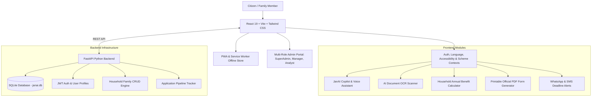

# 🇮🇳 JanAI — Startup-Grade Indian Government & Student Assistance Platform

> **Empowering 1.4 Billion Citizens to Discover, Verify, and Apply for Every Scheme & Scholarship They Deserve.**

[](https://fastapi.tiangolo.com/)
[](https://react.dev/)
[](https://vitejs.dev/)
[](https://www.sqlite.org/)
[](LICENSE)

---

## 📌 Executive Summary

**JanAI** is a next-generation civic technology platform designed to bridge the awareness gap between Indian government welfare schemes and eligible citizen households. By leveraging **Gemini AI RAG**, **FastAPI**, **SQLite**, and **PWA Capabilities**, JanAI enables families across India to discover eligible central and state government schemes, compute total household monetary benefits, auto-verify documents via DigiLocker e-KYC, and generate official printable application forms in 10 regional Indian languages.

---

## 🏗️ System Architecture



---

## ✨ Key Feature Highlights

### 👨‍👩‍👧‍👦 1. Household Family Profiles & Editing Engine
- **Multi-Member Scrutiny**: Manage profiles for **Self (Devanth)**, **Father (Baskar)**, **Mother (Lalitha)**, and **Sister (Pavani)**.
- **Full Editing Suite**: Edit age, occupation, annual income, caste/category, and land ownership with real-time eligibility recalculation.

### 💰 2. Total Household Benefit Calculator
- **Direct Credit Estimator**: Computes total annual monetary benefits for the entire household (e.g. *PM-Kisan ₹6,000 + Post-Matric Scholarships ₹40,000 = ₹51,000 / year*).
- **DBT Bank Account Guidance**: Direct Benefit Transfer NPCI bank link status monitoring.

### 📄 3. Printable Official PDF Application Generator
- **Instant Official Form**: Generates official Common Application Form PDFs complete with citizen particulars, family declaration, document checklist, and digital signature for offline office submission.

### 🔒 4. DigiLocker & Aadhaar e-KYC Verifier
- **One-Tap e-KYC**: Import Aadhaar, Income & Caste certificates directly from Ministry of IT (MeitY) with instant **"Verified Citizen"** badge.

### 📲 5. WhatsApp & SMS Deadline Alert System
- **Real-time Deadline Notifications**: Automated alerts for upcoming scholarship deadlines and PM-Kisan bank sanction updates.

### ⚖️ 6. 3-Scheme Side-by-Side Comparison Radar
- **Multi-Metric Matrix**: Compare 3 schemes simultaneously on benefit amounts, jurisdiction, document friction, and AI approval scores.

### 🗣️ 7. 10 Regional Languages & Voice Assistant
- **Localization Suite**: Supported in English, Telugu, Hindi, Tamil, Kannada, Bengali, Marathi, Malayalam, Gujarati, and Punjabi with Web Speech TTS.

### 🛡️ 8. Startup Multi-Role Admin Portal (`/admin`)
- **Role-Based Access Control**: Switch between **Super Admin**, **Content Manager**, **Moderator**, and **Data Analyst** with DAU metrics and scheme import capabilities.

---

## 🛠️ Technology Stack

| Domain | Technology | Description |
| :--- | :--- | :--- |
| **Frontend Framework** | React 19 + Vite 8 | Fast SPA rendering & HMR |
| **Styling & Design System** | Tailwind CSS v4 | Dark mode glassmorphism & accessibility |
| **Backend API** | FastAPI (Python 3.12) | High-performance async REST API |
| **Database** | SQLite 3 (`janai.db`) | Relational persistence for profiles & applications |
| **AI Engine** | Gemini 2.0 Flash + Local RAG | Intelligent scheme matcher & prompt engine |
| **PWA & Offline** | Web Manifest + Service Worker | Offline scheme browsing & installability |

---

## 🚀 Installation & Local Setup Guide

### 1. Prerequisites
- **Node.js**: v18.0.0 or higher
- **Python**: v3.10.0 or higher
- **Git**

### 2. Clone Repository
```bash
git clone https://github.com/YOUR_GITHUB_USERNAME/janai-project.git
cd janai-project
```

### 3. Setup Backend (FastAPI + SQLite)
```bash
cd backend
python -m pip install -r requirements.txt
python app/database.py  # Seed initial database
python -m uvicorn app.main:app --port 8000
```
> **Backend Docs**: Visit `http://127.0.0.1:8000/docs` for interactive Swagger UI.

### 4. Setup Frontend (React 19 + Vite)
```bash
# In a new terminal window:
cd frontend
npm install
npm run dev
```
> **Frontend Web UI**: Open `http://localhost:5174/` in your browser.

---

## 🧪 Verification & Testing Commands

```bash
# Frontend Linter Check
cd frontend
npm run lint

# Frontend Production Build
npm run build

# Backend Health Test
python -c "import urllib.request; print(urllib.request.urlopen('http://127.0.0.1:8000/api/health').read().decode())"
```

---

## 📜 License

Distributed under the **MIT License**. See `LICENSE` for more information.

---

<p center>Built with ❤️ for Indian Citizens by Devanth .</p>
