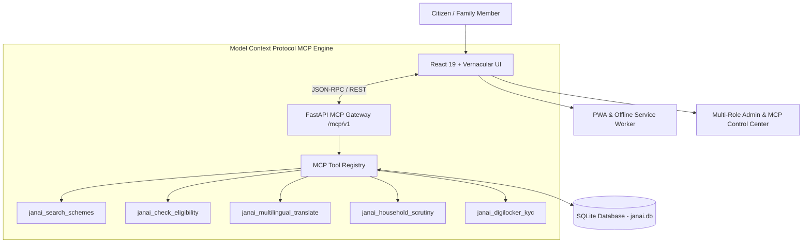

# 🇮🇳 JanAI — Startup-Grade Indian Government & Student Assistance Platform

> **Empowering 1.4 Billion Citizens with Model Context Protocol (MCP) & 22-Language Vernacular AI.**

[](https://modelcontextprotocol.io/)
[](#-22-scheduled-languages--code-switching)
[](https://fastapi.tiangolo.com/)
[](https://react.dev/)
[](https://www.sqlite.org/)

---

## 📌 Executive Summary & Founder Mandate

Founded by **Desvanth**, **JanAI** is a visionary civic technology startup addressing the primary bottleneck in Indian public welfare: **Language Barriers and Complex Bureaucratic Jargon**.

While legacy platforms attempt standard 11-language machine translation (e.g., Sarvam AI), **JanAI breaks language barriers** by providing:
1. **22 Official Scheduled Languages of India** + Code-Switched vernacular dialects (Hinglish, Teluglish, Tanglish).
2. **Model Context Protocol (MCP) Backend Architecture** (`/mcp/v1/tools`), exposing standardized AI context & tools to external agents (Gemini, Claude, JanAI Copilot).
3. **Vernacular Jargon Simplifier**: Translating complex terms (*"Direct Benefit Transfer"*, *"Pattadar Passbook"*, *"Domicile Certificate"*) into 5th-grade local village terms with zero bureaucracy friction.

---

## 🏗️ System & MCP Architecture



---

## 🌐 22 Scheduled Languages & Code-Switching

JanAI natively supports all **22 Official Scheduled Languages of India** plus code-mixed dialects:

| Language | Script | Region | Language | Script | Region |
| :--- | :--- | :--- | :--- | :--- | :--- |
| **English** | Latin | Pan-India | **Assamese** | Bengali | Assam |
| **Hindi** | Devanagari | North/Central | **Maithili** | Devanagari | Bihar |
| **Telugu** | Telugu | AP & Telangana | **Santali** | Ol Chiki | Jharkhand |
| **Tamil** | Tamil | Tamil Nadu | **Kashmiri** | Devanagari | J&K |
| **Kannada** | Kannada | Karnataka | **Nepali** | Devanagari | Sikkim/WB |
| **Bengali** | Bengali | West Bengal | **Konkani** | Devanagari | Goa |
| **Marathi** | Devanagari | Maharashtra | **Dogri** | Devanagari | J&K |
| **Malayalam** | Malayalam | Kerala | **Manipuri** | Meitei | Manipur |
| **Gujarati** | Gujarati | Gujarat | **Bodo** | Devanagari | Assam |
| **Punjabi** | Gurmukhi | Punjab | **Sanskrit** | Devanagari | Pan-India |
| **Odia** | Odia | Odisha | **Sindhi** | Devanagari | Pan-India |
| **Hinglish** | Latin | Code-Mixed | **Teluglish** | Latin | Code-Mixed |

---

## 🔌 Model Context Protocol (MCP) Endpoints

The backend server hosts compliant MCP endpoints:

- `GET /mcp/v1/info` — Handshake protocol capability information.
- `GET /mcp/v1/tools` — Discovers registered MCP tools.
- `POST /mcp/v1/call` — Executes an MCP tool call (e.g. scheme search, eligibility check, vernacular simplification).

### Registered MCP Tools:
1. `janai_search_schemes`: Natural language query search over 25+ verified central and state schemes in 22 languages.
2. `janai_check_eligibility`: Rule evaluation based on age, income, caste, land, and occupation.
3. `janai_multilingual_translate`: Jargon simplification into rural vernacular dialects.
4. `janai_household_scrutiny`: Family member eligibility matrix scanner.
5. `janai_digilocker_kyc`: MeitY DigiLocker e-KYC document verification.

---

## 🛠️ Technology Stack

| Domain | Technology | Description |
| :--- | :--- | :--- |
| **Protocol** | Model Context Protocol (MCP 2.0) | Standard AI tool & context protocol |
| **Frontend Framework** | React 19 + Vite 8 | High-speed SPA rendering & HMR |
| **Styling & Design** | Tailwind CSS v4 | Dark mode glassmorphism & responsive UI |
| **Backend API** | FastAPI (Python 3.12) | MCP JSON-RPC + REST API endpoints |
| **Database** | SQLite 3 (`janai.db`) | Relational persistence for citizen & family profiles |
| **AI Engine** | Gemini 2.0 Flash + Vernacular RAG | Intelligent scheme matcher & prompt engine |

---

## 🚀 Quick Start Guide

### 1. Start Backend MCP Server (`http://127.0.0.1:8000`)
```bash
cd backend
python -m pip install -r requirements.txt
python app/database.py
python -m uvicorn app.main:app --port 8000
```

### 2. Start Frontend SPA (`http://localhost:5173/`)
```bash
cd frontend
npm install
npm run dev
```

---

## 📜 License

Distributed under the **MIT License**. Created by **Devanth** (Founder, JanAI).
