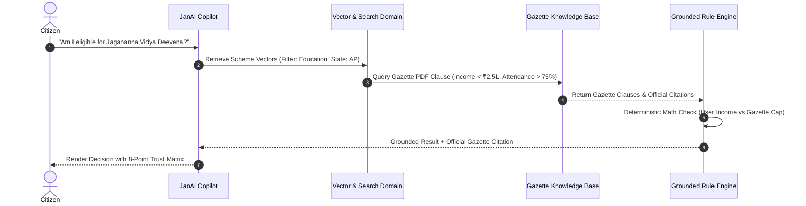

# 🤖 AI Gazette RAG Reasoning Engine

JanAI uses a **Grounded Gazette RAG Pipeline** to evaluate citizen eligibility without hallucinations.

---

## 🤖 RAG Reasoning Sequence Diagram

```mermaid
sequenceDiagram
    autonumber
    actor Citizen
    participant Copilot as JanAI Copilot
    participant Vector as Vector & Search Domain
    participant Gazette as Gazette Knowledge Base
    participant Evaluator as Grounded Rule Engine

    Citizen->>Copilot: "Am I eligible for Jagananna Vidya Deevena?"
    Copilot->>Vector: Retrieve Scheme Vectors (Filter: Education, State: AP)
    Vector->>Gazette: Query Gazette PDF Clause (Income < ₹2.5L, Attendance > 75%)
    Gazette-->>Evaluator: Return Gazette Clauses & Official Citations
    Evaluator->>Evaluator: Deterministic Math Check (User Income vs Gazette Cap)
    Evaluator-->>Copilot: Grounded Result + Official Gazette Citation
    Copilot-->>Citizen: Render Decision with 8-Point Trust Matrix
```
