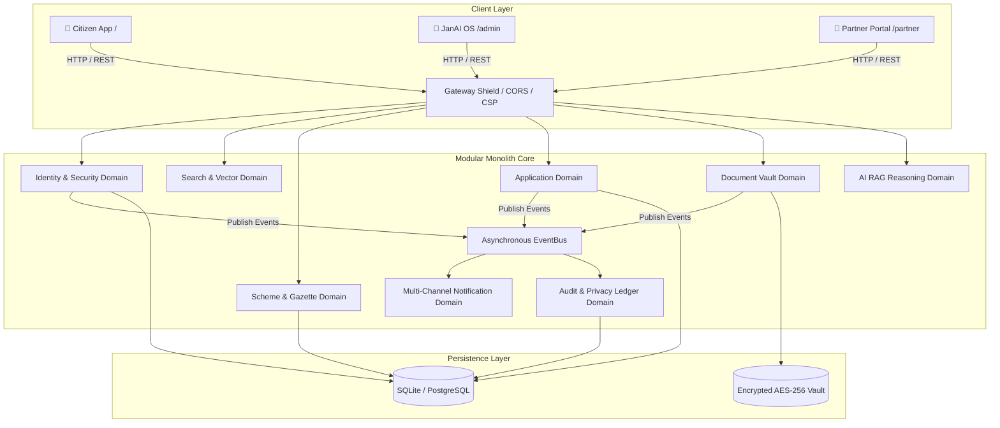
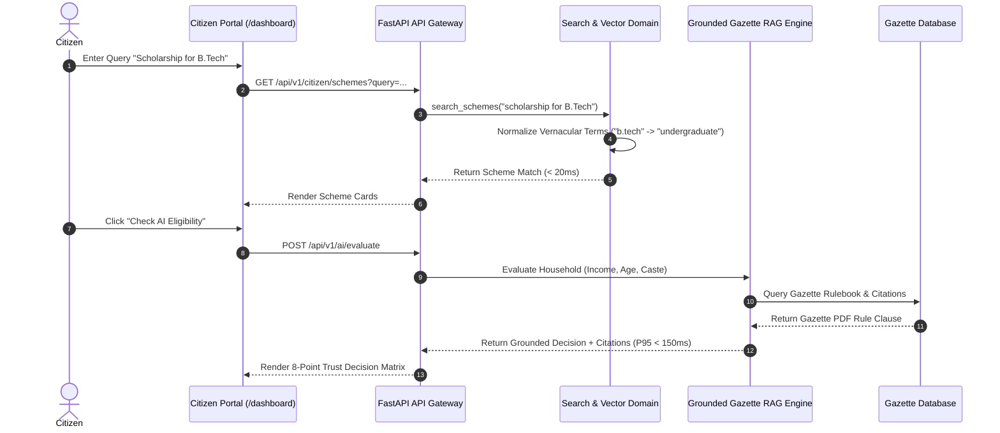

# 🏛️ System Architecture & Visual Workflow Guide

JanAI is engineered as a **Modular Monolith** designed for high-throughput citizen welfare delivery, zero-hallucination AI reasoning, and multi-tenant operational control.

---

## 🌐 Overall Ecosystem Architecture

---

## 🔄 Citizen Request Lifecycle Flow

