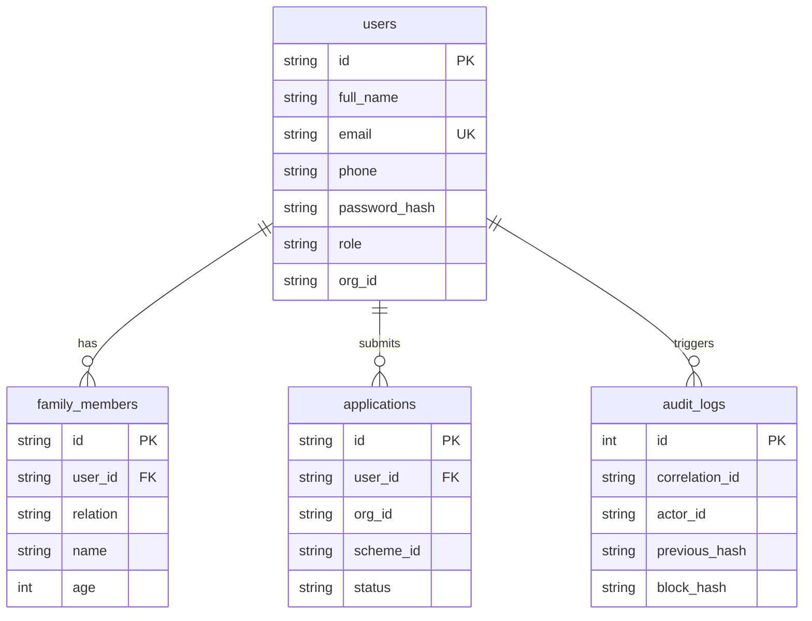

# 🗄️ Database Schema & Entity Relationship

JanAI utilizes SQLite (migratable to PostgreSQL) with cryptographically chained audit logging.

```mermaid
erDiagram
    users ||--o{ family_members : "has"
    users ||--o{ applications : "submits"
    users ||--o{ audit_logs : "triggers"

    users {
        string id PK
        string full_name
        string email UK
        string phone
        string password_hash
        string role
        string org_id
    }

    family_members {
        string id PK
        string user_id FK
        string relation
        string name
        int age
    }

    applications {
        string id PK
        string user_id FK
        string org_id
        string scheme_id
        string status
    }

    audit_logs {
        int id PK
        string correlation_id
        string actor_id
        string previous_hash
        string block_hash
    }
```
