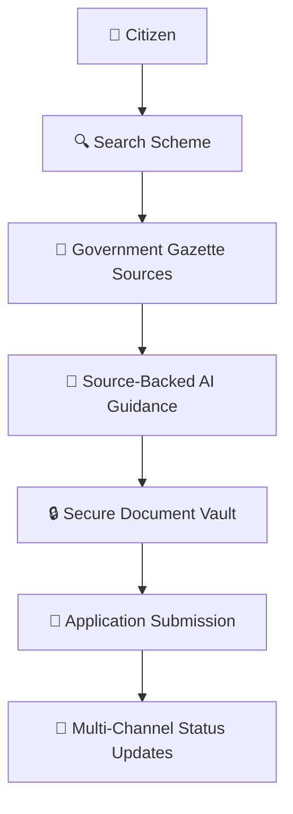

# 🧭 How JanAI Works — A Citizen Journey

This page explains how **JanAI** empowers citizens and government officers, written in plain language for program managers, government partners, and stakeholders.

---

## 🌟 The Citizen Journey

```
 1. Search Scheme ➔ 2. AI Guidance ➔ 3. Verify Criteria ➔ 4. Secure Documents ➔ 5. Submit Application ➔ 6. Status Updates
```

### 1. 🔍 Citizen Searches for a Scheme
A citizen visits JanAI and types or speaks their query in English or their native regional language (e.g., *"Scholarship for B.Tech"* or *"Rythu Bharosa AP farmer"*). Citizens do not need to memorize complex government department acronyms.

### 2. ⚡ JanAI Finds Relevant Gazette Data
JanAI executes high-performance hybrid scheme matching (benchmark target P95 < 20ms) across central and state welfare scheme catalogs, returning verified government gazette information.

### 3. 🤖 Citizen Receives AI Guidance
The citizen asks the JanAI Copilot to evaluate their household eligibility. JanAI grounds responses in retrieved government sources with verified citations, comparing household income, age, occupation, and land ownership against official gazette rules.

### 4. 🔒 Documents Are Securely Stored
The citizen uploads required proof documents (Aadhaar, Income Certificate). JanAI validates uploaded file types before securely storing documents encrypted in the platform vault.

### 5. 📄 Application Is Submitted
The application is assigned a unique tracking ID and routed to the relevant nodal officer or partner organization (e.g., Andhra University CSC).

### 6. 🔔 Status Updates Are Provided
As the application progresses through verification milestones, the citizen receives status notifications via multi-channel alerts (SMS, Email, Push, and In-App messages).

---

## 📊 Visual Workflow Summary


