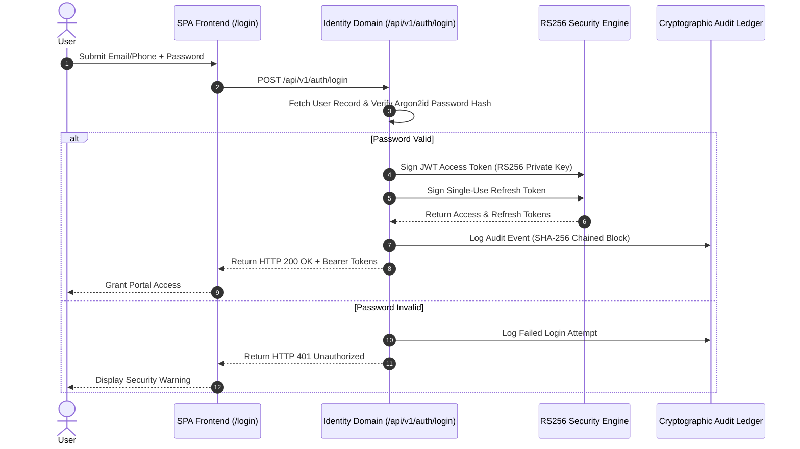

# 🔒 Security Architecture & Authentication Sequence

JanAI enforces strict zero-trust security standards using asymmetric RS256 RSA JWT token signing and cryptographically chained audit logging.

---

## 🔑 RS256 Authentication Sequence Diagram

